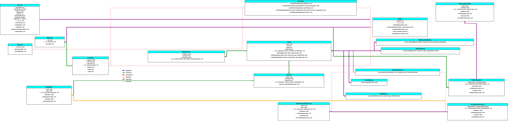

# SWAGCRAFT UML Editor 
This project is a UML editor written in python, The current iteration supports a CLI and GUI mode for the user to interact with. Future plans for the project include refactoring code to use Object Oriented Python (OOP) and to include design patterns.

## Installation
the first step to install the project is to navigate to the group github and preform a git clone on the main branch of the project (assuming you have access).
  
The project uses colorama to enhance the CLI user experience by added a multi-colored output in the command line. The project also uses tkinter and custom tkinter to support GUI functionality and display to the user. 

Dependencies required to be installed before the application will function are custom tkinter and tkinter using and colorama:
```
pip(3) install tk
pip(3) install customtkinter 
pip(3) install colorama
pip(3) install Pillow
```

1) navigate to the github (https://github.com/hbarton2/cscd350-f24-SWAGCRAFT) and use the git clone feature by selecting the green "Code" tab and selecting the HTTPS option then selecting "Copy URL to Clipboard"

2) once the URL is copied you will go to your command line on your machine or in a VM, if issues occur installing colorama dependency using a VM is recommended. Navigate to the place you want to install the git clone. Once in the correct directory run the command `git clone https://github.com/hbarton2/cscd350-f24-SWAGCRAFT.git`
3) After the git clone is completed navigate to the folder then the application can be ran using the command `python3 main.py ['cli' or 'gui']` which will start the program in the respective mode.
4) In the CLI interface  user interaction works using text commands, each command will be listed when the program starts and additional information can be found by typing `help`
5) in the GUI interface the user interacts with the buttons which are straightforward and labeled clearly.
## CLI Commands
```
-------------------------------------------------------------------

- List Classes | : Display all available classes and their details.

- Show Class | : Show details of a specific class.

- Add Class | : Add a new class.

- Rename Class | : Rename the current class.

- Delete Class | : Delete the current class.

- Add Method | : Add a method to the current class.

- Rename Method | : Rename a method.

- Delete Method | : Delete a method from the current class.

- Change Method Type | : Change method return type

- Add a Parameter | : Add a parameter to a method.

- Remove a Parameter | : Remove a parameter from a method.

- Rename a Parameter | : Rename a parameter belonging to an existing method.

- Change Param Type | : Change parameter type

- Add Field | : Add a field to the current class.

- Rename Field | : Rename a field.

- Delete Field | : Delete a field from the current class.

- Change Field Type | : Change the type category of a field

- Add Relationship | : Create a relationship between classes.

- Delete Relationship | : Remove a relationship between classes.

- Show Relationships | : Show the relationships between all classes.

- Change Relation Type | : Change a relationship type between two classes.

- Undo | : Undo action taken to diagram

- Redo | : Redo undone operation

- Save | : Save the diagram.

- Load | : Load the diagram.

- Help | : Display this help menu.

- Exit | : Exit the program gracefully.
-------------------------------------------------------------------
```

## UML Render Example of Our Project

Below is an example render of the UML diagram generated using this project


